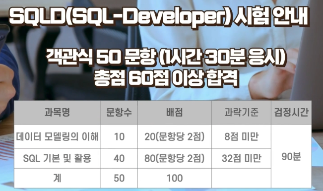
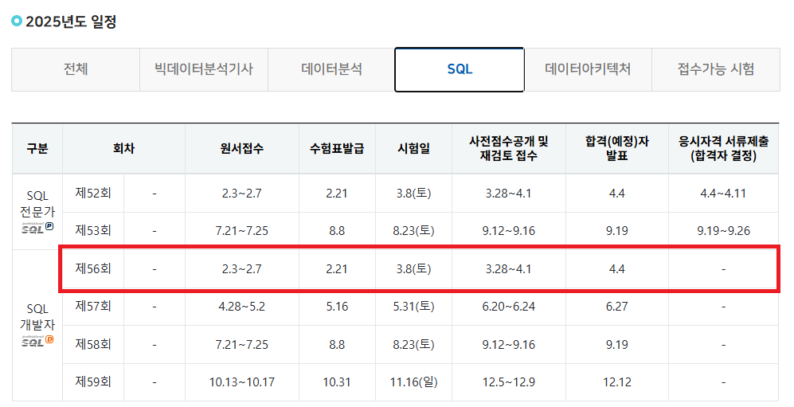

# SQLD

## 📌 시험 구성

- 커트라인: 60점
  - 총 50문제 중, 30문제 맞으면 합격.
  - 과락 기준:
    - 1과목: 10문제 중, 4문제 이상 맞춰야 함.
    - 2과목: 40문제 중, 16문제 이상 맞춰야 함.
- ALL 객관식.

## 📅 시험 일정

> 데이터자격시험 홈페이지 : https://www.dataq.or.kr/www/main.do

## 📌 강의 소개

- HDATALAB 홈페이지 : https://hdatalab.co.kr/
- 강사 : 홍쌤 (홍은혜 강사)
- 유료 강의 (13,800원)
  - PDF 교재 제공
  - 유효기간: 60일
- 교재
  - 총 319 페이지
    - 이론 : 156 페이지
    - 예상문제 : 163 페이지

## 📅 수강 History

| 분류     | 제목                            | 강의분량      | 학습일                        | 비고        |
|--------|-------------------------------|-----------|----------------------------|-----------|
| 1과목    | `데이터모델링의 이해`                  | 1시간 23분   | 2025.01.24 (금)             |           |
| 2과목    | SQL 기본 및 활용 - Part1. `SQL 기본` | 1시간 55분   | 2025.01.27 (월)             |           |
| 2과목    | SQL 기본 및 활용 - Part2. `SQL 활용` | 3시간 10분   | 2025.01.28 (화) ~ 01.31 (금) |           |
| 2과목    | SQL 기본 및 활용 - Part2. `SQL 활용` | 3시간 10분   | 2025.02.03 (월) ~ 02.04 (화) |           |
| 기출문제풀이 | `SQLD 1회차`                    | 1시간 20분   | 2025.02.04 (화) ~ 02.06 (목) | 50점 (불합격) |
| 기출문제풀이 | `SQLD 2회차`                    | 1시간 11분   | 2025.02.16 (일) ~ 02.18 (화) | 60점 (합격)  |
| 기출문제풀이 | `SQLD 3회차`                    | 1시간 17분   | 2025.02.19 (화) ~ 02.20 (수) | 74점 (합격)  |
| 기출문제풀이 | `SQLD 4회차`                    | 47분       | 2025.02.21 (금), 02.24 (월)  | 66점 (합격)  |
| 기출문제풀이 | `SQLD 5회차`                    | 41분       | 2025.02.25 (화)             | 66점 (합격)  |
| 기출문제풀이 | `SQLD 6회차`                    | (해설영상 없음) | 2025.02.26 (수)             | 72점 (합격)  |

- 기타 공부
  - 2025.02.07 (금) ~ 02.14 (금) : 이론교재 - 전체 1회독 (총 154 페이지)
  - 2025.02.27 (목) ~ 02.28 (금) : 전체 기출문제 오답노트 1회독
  - 2025.02.28 (금) : [이론교재 키워드 정리](keyword.md)

## 🔎 교재 목차 (이론)

- 1과목 : `데이터모델링의 이해`
    - Part1.데이터 모델링의 이해
      - 1-1. 데이터 모델의 이해
      - 1-2. 엔터티(Entity)
      - 1-3. 속성
      - 1-4. 관계
      - 1-5. 식별자
    - Part2. 데이터 모델과 SQL
      - 1-6. 정규화
      - 1-7. 관계와 조인의 이해
      - 1-8. 모델이 표현하는 트랜잭션의 이해
      - 1-9. Null 속성의 이해
      - 1-10. 본질식별자 vs 인조식별자
      
- 2과목 : SQL 기본 및 활용
  - Part1. `SQL 기본`
    - 2-1. 관계형 데이터베이스 개요
    - 2-2. SELECT 문
    - 2-3. 함수
    - 2-4. WHERE 절
    - 2-5. GROUP BY, HAVING 절
    - 2-6. ORDER BY 절
    - 2-7. 조인
    - 2-8. 표준 조인
  - Part2. `SQL 활용`
    - 2-9. 서브 쿼리
    - 2-10. 집합 연산자
    - 2-11. 그룹 함수
    - 2-12. 윈도우 함수
    - 2-13. Top N 쿼리
    - 2-14. 계층형 질의와 셀프 조인
    - 2-15. PIVOT 절과 UNPIVOT절
    - 2-16. 정규 표현식
  - Part3. `SQL 관리구문`
    - 2-17. DML
    - 2-18. TCL
    - 2-19. DDL
    - 2-20. DCL
